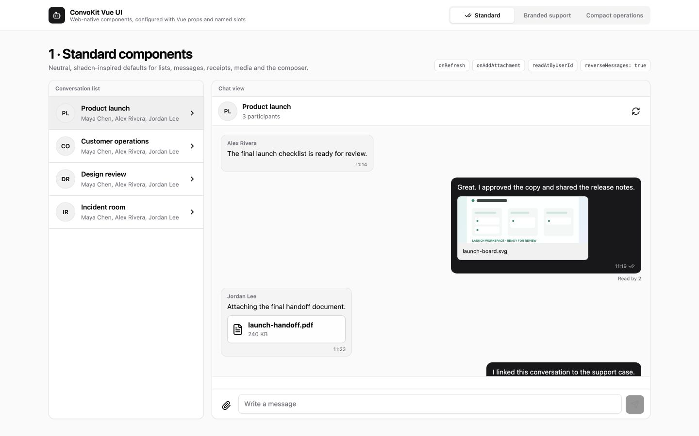
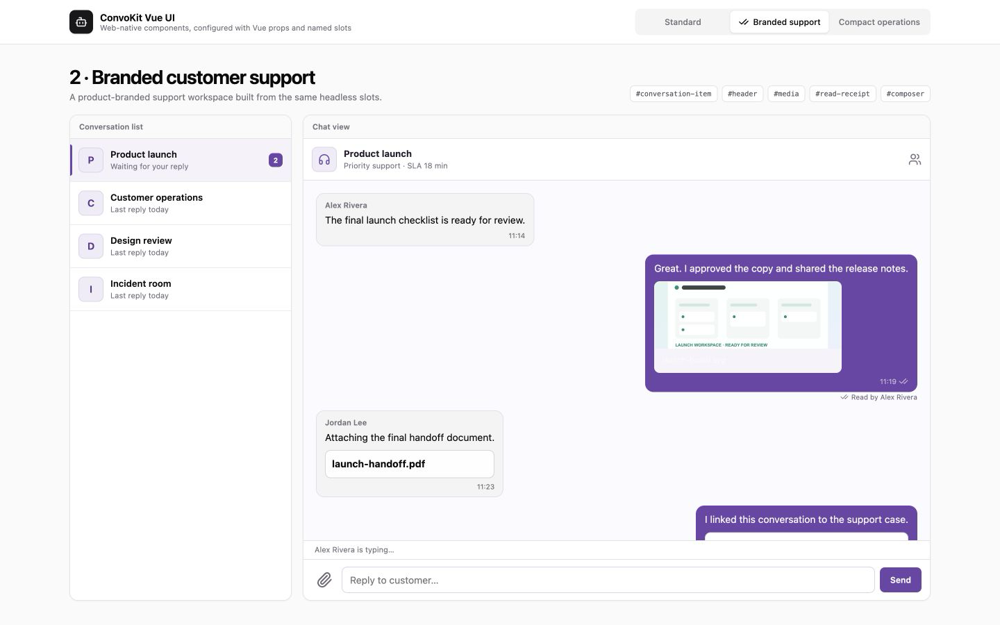
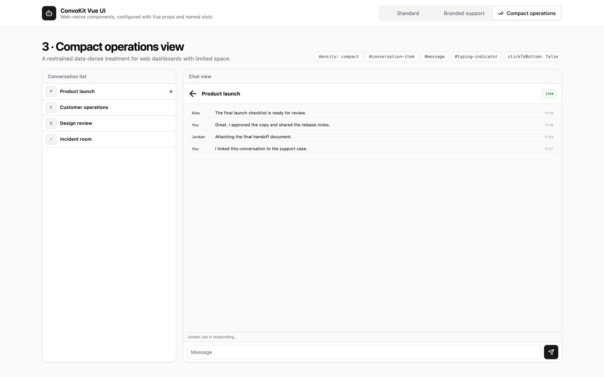

# ConvoKit Vue UI examples

Public, runnable examples showing how an application can configure
[`@convokitapp/vue-ui`](https://www.npmjs.com/package/@convokitapp/vue-ui)
without copying or modifying the private package source.

This repository contains application code only. It depends on the published
Vue UI package and the core [`@convokitapp/sdk`](https://www.npmjs.com/package/@convokitapp/sdk).

## Component showcase

The default entry point uses fixture data, so it runs without a backend, client
ID, or client secret:

```bash
npm install
npm run dev
```

Use the selector to compare configurations, or open `?variant=standard`,
`?variant=branded`, or `?variant=compact` directly.

### Standard components



Web-native, shadcn-inspired package defaults plus refresh, attachment,
read-position, image/file rendering, and bottom-anchored messages.

### Branded customer support



A restrained product-branded support workspace built with the `conversation-item`, `header`,
`media`, `read-receipt`, and `composer` named slots.

### Compact operations



A dense dashboard built with `density="compact"`, custom rows, message lines,
typing state, composer, and `stick-to-bottom="false"`.

The complete configuration is in [`src/ShowcaseApp.vue`](src/ShowcaseApp.vue).

## Live SDK-backed example

Open `?mode=live` after providing these public frontend settings:

```bash
VITE_CONVOKIT_BACKEND_URL=https://api.example.com
VITE_CONVOKIT_CLIENT_ID=public-client-id
VITE_CONVOKIT_TOKEN_ENDPOINT=https://app.example.com/api/convokit-token
```

The token endpoint runs on your backend and must authenticate the host user.
Never expose the ConvoKit client secret in a Vue application or Vite variable.

## Verification

```bash
npm ci
npm run validate
```
